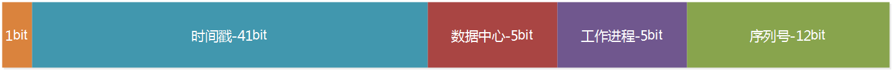

# goid

go实现的id生成器，使用snowflake算法

## 结构



 - 1bit 不使用
 - 41bit 时间戳：包含创建ID的时间信息
 - 5bit 数据中心：表示数据中心节点（最多32个）
 - 5bit 工作进程：表示id生成器工作的进程（最多32个）
 - 12bit 序列号：表示1毫秒内的自增序列（最多4096个）

## 说明

 - 生成器是线程安全的
 - 当1毫秒内工作序列达到上限（4096），将等待下一毫秒后，将序列至0，再返回ID

## APIs

  (请参考test目录下的测试用例)

- 创建ID生成器

```
func NewSnowFlake() *SnowFlake
```

- 获得唯一ID

```
func (sf *SnowFlake) NextId() (SFId, error) 
```

- 解析ID中包含的所有信息

```
func (id SFId) Parse() map[string]int64
```

- 获得int64类型的id

```
func (id SFId) Int64() int64
```

- 获得string类型id

```
func (id SFId) String() string
```

- 获得时间戳

```
func (id SFId) Timestamp() time.Duration
```

- 获得时间信息

```
func (id SFId) Time() time.Time
```

- 将id转换为压缩SFStrId（string）类型，可以大幅缩短ID

```
func (id SFId) Compress() SFStrId
```
